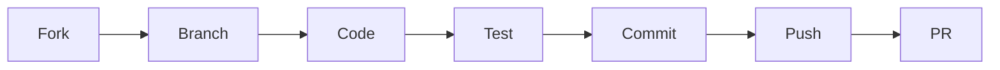

# Contributing to UnZip Web

First off, thank you for considering contributing to UnZip Web! Every contribution helps make this project better.

## Table of Contents

- [Code of Conduct](#code-of-conduct)
- [Getting Started](#getting-started)
- [Development Workflow](#development-workflow)
- [Project Structure](#project-structure)
- [Coding Standards](#coding-standards)
- [Commit Convention](#commit-convention)
- [Pull Request Process](#pull-request-process)

## Code of Conduct

This project adheres to the [Code of Conduct](CODE_OF_CONDUCT.md). By participating, you are expected to uphold this code.

## Getting Started

### Prerequisites

- Node.js >= 18.0.0
- npm >= 9.0.0
- Git

### Setup

```bash
# Fork and clone the repository
git clone https://github.com/YOUR_USERNAME/unzip-web.git
cd unzip-web

# Install dependencies
npm install

# Start development server
npm run dev
```

## Development Workflow



1. **Fork** the repository
2. **Create** a feature branch: `git checkout -b feat/amazing-feature`
3. **Code** your changes
4. **Test** locally: `npm run build`
5. **Commit** using [Conventional Commits](#commit-convention)
6. **Push** to your fork: `git push origin feat/amazing-feature`
7. **Open** a Pull Request

## Project Structure

```
src/
├── components/     # Reusable UI components
├── hooks/          # Custom React hooks
├── pages/          # Route-level page components
├── index.css       # Global styles and design tokens
└── main.jsx        # Application entry point
```

## Coding Standards

- **Components**: Functional components with hooks
- **Styling**: CSS Modules pattern (component-level CSS files)
- **Naming**: PascalCase for components, camelCase for functions/hooks
- **Formatting**: Prettier (auto-formatted on save)
- **Linting**: OxLint for fast linting

### File Naming

| Type | Convention | Example |
|------|-----------|---------|
| Component | PascalCase | `FileBrowser.jsx` |
| Hook | camelCase with `use` prefix | `useUpload.js` |
| Style | Same as component | `FileBrowser.css` |
| Page | PascalCase | `UploadPage.jsx` |

## Commit Convention

We use [Conventional Commits](https://www.conventionalcommits.org/):

```
<type>(<scope>): <description>

[optional body]
```

### Types

| Type | Description |
|------|-------------|
| `feat` | New feature |
| `fix` | Bug fix |
| `docs` | Documentation |
| `style` | Formatting (no code change) |
| `refactor` | Code refactoring |
| `perf` | Performance improvement |
| `test` | Adding tests |
| `build` | Build system changes |
| `ci` | CI configuration |
| `chore` | Maintenance |

### Examples

```
feat(upload): add drag-and-drop support for multiple files
fix(extract): handle corrupted ZIP entries gracefully
docs: update README with deployment guide
perf(browser): lazy load file browser component
```

## Pull Request Process

1. Update documentation if needed
2. Ensure the build passes: `npm run build`
3. Ensure code is formatted: `npm run format:check`
4. Fill out the PR template completely
5. Request a review from maintainers

### PR Title Format

Use the same convention as commits:

```
feat(upload): add resume support for failed uploads
```

## Need Help?

- Open a [Discussion](https://github.com/devxashish/unzip-web/discussions)
- Check existing [Issues](https://github.com/devxashish/unzip-web/issues)
- Read the [Support Guide](SUPPORT.md)

---

Thank you for contributing!
