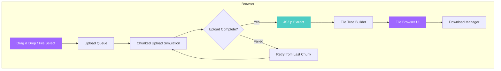
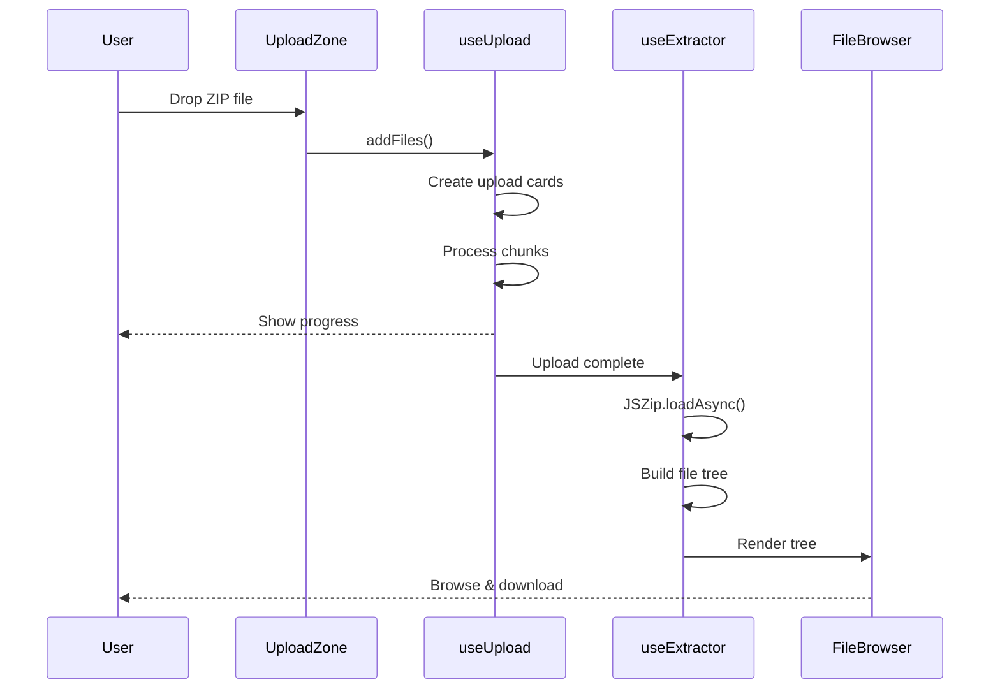

<div align="center">

# UnZip Web

### Extract ZIP files instantly — right in your browser.

[](LICENSE)
[](https://github.com/devxashish/unzip-web/actions)
[](https://github.com/devxashish/unzip-web/stargazers)
[](https://github.com/devxashish/unzip-web/issues)


**Fast. Free. Private. No installation needed.**

Upload any ZIP archive and browse, preview, or download files instantly.
Everything runs 100% client-side — your files never leave your device.

[Features](#features) · [Quick Start](#quick-start) · [Documentation](#documentation) · [Contributing](#contributing)

---

</div>

## Features

- **Drag & Drop Upload** — Drop ZIP files anywhere on the page
- **Multiple Simultaneous Uploads** — Upload 5, 10, or more ZIPs at once
- **Auto-Extract** — Files are extracted automatically after upload
- **File Browser** — Navigate extracted files with a full tree view
- **Smart Selection** — Select files, folders, or any combination
- **Download Anything** — Single files, folders, or batch ZIP downloads
- **Resume Uploads** — Failed uploads resume from the last chunk
- **100% Private** — All processing happens in your browser
- **Mobile Friendly** — Fully responsive on all devices
- **Zero Config** — No accounts, no sign-ups, no tracking

## Architecture



## Quick Start

### Prerequisites

- [Node.js](https://nodejs.org/) >= 18.0.0
- npm >= 9.0.0

### Installation

```bash
# Clone the repository
git clone https://github.com/devxashish/unzip-web.git
cd unzip-web

# Install dependencies
npm install

# Start development server
npm run dev
```

The app will be running at `http://localhost:5173`.

### Build for Production

```bash
npm run build
npm run preview
```

## Documentation

### Project Structure

```
unzip-web/
├── public/                  # Static assets
│   ├── favicon.svg
│   └── icons.svg
├── src/
│   ├── components/          # Reusable UI components
│   │   ├── FAQ.jsx          # Accordion FAQ section
│   │   ├── Features.jsx     # Feature grid cards
│   │   ├── FileBrowser.jsx  # ZIP file tree browser
│   │   ├── FileManager.jsx  # File manager preview
│   │   ├── Footer.jsx       # Site footer with CTA
│   │   ├── Formats.jsx      # Supported formats grid
│   │   ├── Header.jsx       # Navigation header
│   │   ├── Hero.jsx         # Hero section with typewriter
│   │   ├── HowItWorks.jsx   # Step-by-step guide
│   │   ├── LogoTicker.jsx   # Logo carousel
│   │   ├── Performance.jsx  # Performance stats
│   │   └── Security.jsx     # Security features
│   ├── hooks/               # Custom React hooks
│   │   ├── useAnimations.js # InView, typewriter, countUp
│   │   ├── useExtractor.js  # ZIP extraction with JSZip
│   │   └── useUpload.js     # Chunked upload management
│   ├── pages/               # Route-level pages
│   │   ├── HomePage.jsx     # Landing page
│   │   ├── UploadPage.jsx   # Upload & extract page
│   │   └── UploadPage.css   # Upload page styles
│   ├── App.jsx              # Router setup
│   ├── App.css              # App-level styles
│   ├── index.css            # Design system tokens
│   └── main.jsx             # Entry point
├── .github/                 # GitHub configuration
│   ├── workflows/ci.yml     # CI pipeline
│   ├── ISSUE_TEMPLATE/      # Issue templates
│   ├── PULL_REQUEST_TEMPLATE.md
│   └── dependabot.yml
├── index.html               # HTML entry
├── vite.config.js           # Vite configuration
└── package.json
```

### Upload Flow



### Available Scripts

| Command | Description |
|---------|-------------|
| `npm run dev` | Start development server with HMR |
| `npm run build` | Build for production |
| `npm run preview` | Preview production build |
| `npm run lint` | Run OxLint |
| `npm run format` | Format code with Prettier |
| `npm run format:check` | Check formatting |

### Tech Stack

| Technology | Purpose |
|-----------|---------|
| [React 19](https://react.dev/) | UI framework |
| [Vite 8](https://vite.dev/) | Build tool & dev server |
| [React Router 7](https://reactrouter.com/) | Client-side routing |
| [JSZip](https://stuk.github.io/jszip/) | Client-side ZIP extraction |
| [OxLint](https://oxc-project.github.io/) | Fast JavaScript linter |
| [Prettier](https://prettier.io/) | Code formatter |

### Design System

The UI is built with a custom CSS design system using CSS custom properties:

| Token | Value | Usage |
|-------|-------|-------|
| `--primary` | `#A068FF` | Brand purple |
| `--bg-body` | `#0a0a0a` | Page background |
| `--surface` | `#111111` | Card surfaces |
| `--radius-lg` | `16px` | Card corners |
| `--ease-out` | `cubic-bezier(0.22, 1, 0.36, 1)` | Smooth transitions |
| `--font-display` | `Urbanist` | Headings |
| `--font-sans` | `Inter` | Body text |

## Deployment

### Vercel

[](https://vercel.com/new/clone?repository-url=https://github.com/devxashish/unzip-web)

### Netlify

[](https://app.netlify.com/start/deploy?repository=https://github.com/devxashish/unzip-web)

### Manual Deployment

```bash
npm run build
# Deploy the `dist/` folder to any static hosting
```

### Docker

```dockerfile
FROM node:20-alpine AS build
WORKDIR /app
COPY package*.json ./
RUN npm ci
COPY . .
RUN npm run build

FROM nginx:alpine
COPY --from=build /app/dist /usr/share/nginx/html
EXPOSE 80
```

## Browser Support

| Browser | Version |
|---------|---------|
| Chrome | 90+ |
| Firefox | 90+ |
| Safari | 15+ |
| Edge | 90+ |

## Performance

- **Zero server calls** — Everything runs client-side
- **Chunked processing** — Large files processed in 2MB chunks
- **Streaming extraction** — Low memory footprint
- **Lazy routing** — Pages load on demand
- **Optimized animations** — GPU-accelerated CSS transforms

## Security

- All files are processed **100% client-side**
- No data is ever transmitted to external servers
- Files are removed from memory when the tab closes
- No cookies, tracking, or analytics
- See [SECURITY.md](SECURITY.md) for the full security policy

## Roadmap

- [ ] RAR, 7Z, and TAR.GZ support
- [ ] File preview (images, PDF, code with syntax highlighting)
- [ ] PWA with offline support
- [ ] File search within archives
- [ ] Dark/Light theme toggle
- [ ] Drag to reorder queue
- [ ] WebAssembly extraction engine
- [ ] Encryption/password-protected ZIP support

## FAQ

<details>
<summary><strong>Is my data safe?</strong></summary>

Yes. All processing happens in your browser. Your files never leave your device. There are no server uploads, no tracking, and no data collection.
</details>

<details>
<summary><strong>What's the maximum file size?</strong></summary>

UnZip Web can handle archives up to 10GB depending on your device's available memory. Files are processed in streaming chunks to minimize memory usage.
</details>

<details>
<summary><strong>Can I extract multiple ZIPs at once?</strong></summary>

Yes! You can upload and extract multiple ZIP files simultaneously. Each gets its own progress card and file browser.
</details>

<details>
<summary><strong>What formats are supported?</strong></summary>

Currently ZIP archives. Support for RAR, 7Z, and TAR.GZ is on the roadmap.
</details>

## Contributing

Contributions are welcome! Please read the [Contributing Guide](CONTRIBUTING.md) before submitting a PR.

```bash
# Fork, clone, and set up
git clone https://github.com/YOUR_USERNAME/unzip-web.git
cd unzip-web
npm install
npm run dev
```

See [CONTRIBUTING.md](CONTRIBUTING.md) for the full guide.

## License

This project is licensed under the [MIT License](LICENSE).

## Credits

Built by [@devxashish](https://github.com/devxashish).

---

<div align="center">

**If you find this project useful, consider giving it a star!**

[](https://github.com/devxashish/unzip-web)

</div>
